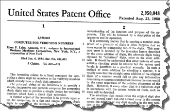
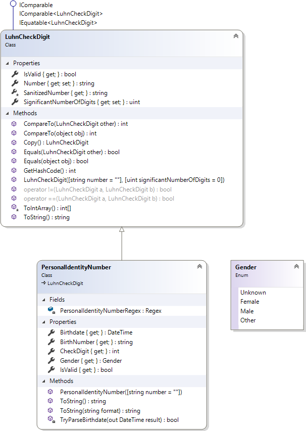

# Personlig kontrollsiffra

- [GitBook](https://coursepress.gitbook.io/1dv024/ovningsuppgifter/del-2/personlig-kontrollsiffra)
- [Lösningsförslag](https://github.com/1dv024/exercise-solution-proposals/tree/master/exercise-personal-check-digit)

<figure>

<figcaption>
Figur 1. Patent för mekanisk dator för beräkning av kontrollsiffra.
</figcaption>
</figure>

[Personnummer](http://www.skatteverket.se/download/18.1e6d5f87115319ffba380001857/1359707375938/70408.pdf), liksom många andra nummer t.ex. artikelnummer och bankgironummer, innehåller en kontrollsiffra som beräknats enligt [Luhns algoritm](https://sv.wikipedia.org/wiki/Luhn-algoritmen/ "Läs om Luhn-algoritmen!"). Du ska skriva en klass, `PersonalIdentityNumber`, som ska validera om ett personnummer är korrekt eller inte. Klassen ska även kunna avgöra det juridiska könet man eller kvinna utifrån personnumret.

Personnummer består av åtta eller sex siffror följt av ett (eventuellt) bindestreck, eller plustecken, och fyra avslutande siffror. Korrekt formaterade personnummer är på formaten `ÅÅMMDD-FFFK`, där `FFF` är ett löpnummer och `K` är en kontrollsiffra (svenska myndigheter lagrar dock personnummer på formatet `ÅÅÅÅMMDDFFFK`).

Andra tillåtna format är `ÅÅÅÅMMDD-FFFK`, `ÅÅMMDDFFFK` och `ÅÅMMDD+FFFK`, som alla ska kunna valideras. Då formatet `ÅÅMMDD-FFFK`, eller `ÅÅMMDDFFFK`, används så tillhör personnumret en person som inte fyllt 100 år. Förekommer det ett +-tecken i personnumret, `ÅÅMMDD+FFFK`, betyder det att personen har fyllt 100 år.

Eftersom du ska låta klassen `PersonalIdentityNumber` ärva från klassen `LuhnCheckDigit`, som är given, behöver inte din klass ha något ”eget” fält för numret, eller metod för att validera numret. Det tillhandahåller basklassen, och du kan koncentrera dig helt och hållet på valideringen av formatet, datumdelen av personnumret och den näst sista siffran som ger det juridiska könet.

Basklassen `LuhnCheckDigit` innehåller en rad medlemmar, och av störst intresse är egenskapen `SanitizedNumber` och `IsValid`, som du har användning av vid implementation av klassen `PersonalIdentityNumber`.

<figure>

<figcaption>
Figur 2. Klassdiagram över <code>PersonalIdentityNumber</code> som ärver från <code>LuhnCheckDigit</code> samt den uppräkningsbara typen <code>Gender</code>.
</figcaption>
</figure>

## Klassen `PersonalIdentityNumber`

### Fält

#### PersonalIdentityNumberRegex

Enklast att kontrollera om ett personnummer har rätt format är att använda ett reguljärt uttryck. Instansiera ett objekt av klassen `Regex` med det reguljära uttrycket `@"^(\d{6}[-+]?|\d{8}-?)\d{4}$"` och undersök därefter om personnumret har rätt format med hjälp av metoden `IsMatch`, som returnerar ett boolskt värde. Det är det statiska privata "read-only" fältet `PersonalIdentityNumberRegex` som ska referera till `Regex`-objektet med det reguljära uttrycket..

### Egenskaper

> Anropas någon av egenskaperna för ett ogiltigt personnummer ska ett undantag kastas. Lämpligt undantag att kasta i detta fall är ett av typen `InvalidOperationException` som ska användas i de fall ”when a method call is invalid for the object's current state” som det står i dokumentationen.

#### Birthdate

En "read-only"-egenskap som ska returnera den del av personnumret som utgör födelsedatumet (ÅÅMMDD) i forma av ett DateTime-objekt.

Är inte personnumret giltigt ska ett undantag av typen `InvalidOperationException` kastas.

#### BirthNumber

En "read-only"-egenskap som ska returnera den del av personnumret som utgör födelsenumret (FFF) i forma av en sträng.

Är inte personnumret giltigt ska ett undantag av typen `InvalidOperationException` kastas.

#### CheckDigit

En "read-only"-egenskap som ska returnera den del av personnumret som utgör kontrollsiffran (K) i forma av ett heltal.

Är inte personnumret giltigt ska ett undantag av typen `InvalidOperationException` kastas.

#### Gender
Egenskapen `Gender` är av den uppräkningsbara typen `Gender` och ska returnera `Gender.Female` om det juridiska könet är kvinna respektive `Gender.Male` om det juridiska könet är man. Om den näst sista siffran i personnumret är jämn är det juridiska könet kvinna; är den udda en man. 

Är inte personnumret giltigt ska ett undantag av typen `InvalidOperationException` kastas.

#### IsValid

Egenskapen `IsValid`, som är publik och överskuggar (_overrides_) metoden med samma namn i basklassen, ska returnera `true` om formatet, datumet och kontrollsiffrans är korrekta; i övriga fall ska `false` returneras.

### Konstruktor
Klassen `PersonalIdentityNumber` har en konstruktor med en parameter av typen `string`, med standardvärdet "", vars parameter du skickar vidare till basklassen. Basklassen behöver information om hur många siffror, räknade från höger, som ska användas då personnumret valideras (10 siffror används vid valideringen).

### Metoder

#### ToString()

Metoden `ToString` i basklassen ska överskuggas (_override_) och ska alltid returnera en sträng med formatet `ÅÅÅÅMMDD-FFFK` oavsett vilket format som användes då personnumret matades in.

Är inte personnumret giltigt är det lämpligt att du låter metoden returnera det oformaterade numret, d.v.s. det värde egenskapen `Number` har.

#### ToString(string format)

Metoden ska konvertera det aktuella `PersonalIdentityNumber`-objektet till en sträng genom att använda specificerat format.

Parameter `format` ska innehålla ett enda tecken som definierar formatet på den returnerade strängen. Om formatet är `null` eller en tom sträng ska formatet `Y` användas.
- Y, "", null: ska ge en sträng på formatet YYYYMMDD-FFFK.
- y: ska ge en sträng på formatet YYMMDD-FFFK eller YYMMDD+FFFK.
- g: ska ge en sträng där det angivna personnumret är oformaterat (d.v.s. det värde egenskapen `Number` har).

Är inte personnumret giltigt är det lämpligt att du låter metoden returnera det oformaterade numret, d.v.s. det värde som formatsträngen `g` returnerar.

Anges annan formatsträng än de ovan angivna ska ett undantag av typen `FormatException` kastas.

#### TryParseBirthdate(out DateTime result)

Metoden `TryParseBirthdate` ska försöka konverterar datumdelen av personnumret till ett `DateTime`-värde. Metodens returvärde indikerar om konverteringen lyckades.

När den metoden returnerar innehåller `result` det `DateTime`-värdet representerande födelsedatumet om konverteringen lyckades, eller `default (DateTime)` om konvertering misslyckades. Konverteringen misslyckas om personnumret är ogiltigt eller datumdelen inte är ett giltigt datum. Argumentet behöver inte vara initierat; ursprungligt värde kommer alltid att skrivas över.

Tänk på att hantering av personnummer med tio siffror kräver extra hantering, och då speciellt hur århundrade ska hanteras. Om personnumret innehåller ett plustecken har personen fyllt 100.

| Personnummer | Datum      |
| -------------|------------|
| 010927-1049  | 2001-09-27 |
| 990612-6074  | 1999-06-12 |
| 9906126074   | 1999-06-12 |
| 010927+1049  | 1901-09-27 |
| 990612+6074  | 1899-06-12 |

## Mål

Efter att ha gjort uppgiften ska du:

- Känna till hur du skapar en klass och instansierar objekt av den.
- Kunna skriva en klass som ärver från en basklass.
- Veta vad det innebär att överskugga en metod i en basklass.
- Förstå och hantera konstruktorer, egenskaper och metoder.
- Kunna använda reguljära uttryck för att verifiera att en sträng uppfyller ställda krav.
- Veta hur du kastar undantag.